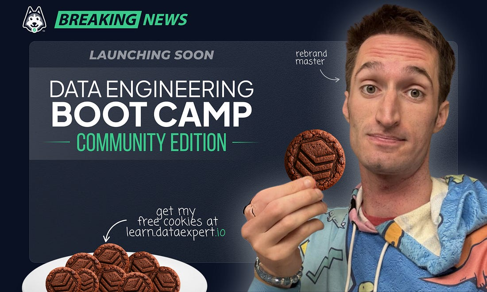
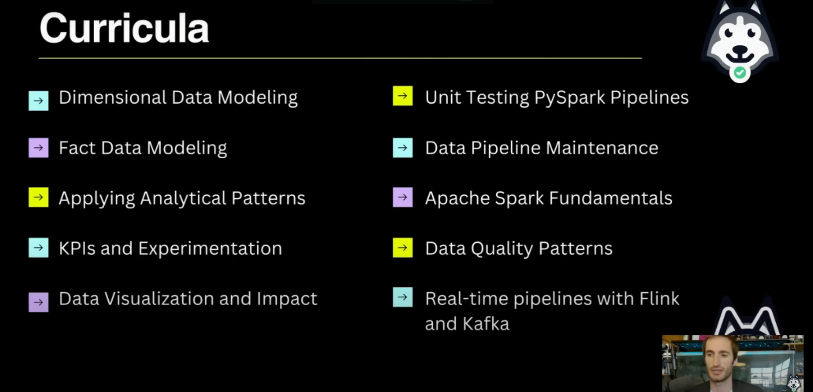

# **Study Notes: DataExpert.io 6-Week Free Data Engineering Boot Camp Kick-off**

## **1. Introduction & Overview**

- **Program:** A free, intense, 6-week data engineering boot camp.
- **Start Date:** November 15th.
- **Video Release:** A new video is published daily around **5:00 PM Pacific Time**.
- **Time Commitment:** Expect to invest **1-2 hours per day** (or 8-10 hours per week on videos and another 8-20 hours on homework, depending on your level). Treat it like a "data engineering gym."
- **Instructor's Goal:** To help 1,000 data engineers get jobs by February 15th through this free boot camp and the paid January cohort.
- **Content Availability:** All content will remain on YouTube for at least a year (until ~Dec 2025), but you are encouraged to act with urgency.

---

## **2. How to Get the Most Out of the Boot Camp**

- **Engage with the Community:** The real value is in the connections you make.
    - Join the **Discord** and find people in your regional channel to form study groups.
    - A Discord bot feature is coming soon to help create and join groups.
    - Make friends and learn together.
- **Do the Work:**
    - Watch all the videos.
    - Do all the homework assignments. The homework is designed to be challenging.
- **Build Your Brand (Optional "Try-Hard" Mode):**
    - After each video, post a key learning or a screenshot on LinkedIn, Twitter, etc.
    - Tag the instructor, and he may help amplify your post to grow your personal brand.

---

## **3. Boot Camp Curriculum**

The curriculum is split into two main tracks: an **Analytical Track** and an **Infrastructure Track**.

| **Analytical Track** | **Infrastructure Track** |
| --- | --- |
| **Dimensional Data Modeling:** (2 weeks) The most critical skill, as your product is data. | **Unit Testing PySpark Pipelines:** Using the Chispa library for robust testing. |
| **Fact Data Modeling:** (2 weeks) The most critical skill, as your product is data. | **Data Pipeline Maintenance:** Learn about runbooks, on-call rotations, and maintaining pipelines at scale. |
| **Applying Analytical Patterns:** Covers advanced concepts like **Growth Accounting** (used at Facebook) and **Advanced SQL** (window functions, etc.). | **Apache Spark Fundamentals:** A 4-hour deep dive into everything you need to know to use Spark effectively. |
| **KPIs & Experimentation:** Learn to think like a product manager, defining good metrics and experiments. | **Data Quality Patterns:** Using **Astronomer** and the powerful **Write-Audit-Publish** pattern to prevent bad data in production. |
| **Data Visualization & Impact:** Focuses on communication, saying "no" to low-value requests, and a practical lesson on **Tableau** (exploratory vs. executive dashboards). | **Real-time Pipelines:** A 4-hour module on using **Flink** and **Kafka**. **Docker setup is mandatory for this section.** |

**Key Technology Requirement:**

- You can start with a local setup (e.g., local PostgreSQL).
- However, you **will need to use Docker** for later modules, especially for **Spark** and **Flink/Kafka**. There is no alternative setup provided.

---

## **4. Boot Camp Structure & Logistics**

- **Content Access:**
    1. **YouTube:** All pre-recorded videos are on the channel: youtube.com/@zthwilson
    2. **DataExpert.io Portal:** To get certified, watch videos on the portal (/lessons) as it tracks your progress.
- **Schedule:** A detailed content schedule is available at bootcamp.techcreator.io/schedule.
- **Labs & Homework:**
    - Each lecture has an associated lab/homework.
    - All materials will be in the **Data Engineer Handbook GitHub repository**.
    - **Your one request:** Please **star the GitHub repo!**
    - You will need to git pull updates as homework is released.

---

## **5. Free Boot Camp vs. Paid Boot Camp (January)**

This free boot camp is a full, comprehensive program, not just a teaser. The paid boot camp offers a different, more advanced, and cloud-focused curriculum with significantly more support.

| Feature | **Free Boot Camp (This one)** | **Paid Boot Camp (January Cohort)** |
| --- | --- | --- |
| **Support** | Community support via Discord. | **Dedicated TA support** and direct access to the instructor (Zach) for questions. |
| **Live Sessions** | None. All content is pre-recorded. | Weekly live Q&A with Zach, plus **2 industry expert guest speakers per week**. |
| **Curriculum Focus** | Fundamentals using local/Docker setups. | **Cloud-focused deployment.** Covers **Snowflake, Trino, dbt, AWS Glue, Apache Iceberg, Spark Streaming** in-depth. |
| **Homework** | AI-graded homework. | Same, plus a **Capstone Project** with dedicated feedback to ensure it's impressive for employers. |
| **Resources** | Publicly available tools and data. | **Free cloud access for 1 year** to deploy your own projects. Includes access to **paid APIs** (e.g., Polygon for stocks, ScrapingDog for social media). |
| **Post-Bootcamp** | A valuable certificate of completion. | **Mentorship and job interview training** for certified students to help you land a job. |
| **Relationship** | The two boot camps **complement** each other, they don't replace each other. Doing both will set you up for great success. |  |

---

## **6. Homework Submission**

- **Where:** Submissions are done on the dashboard: bootcamp.techcreator.io/assignments.
- **How:** You must upload a **zip file** containing only the required files for the assignment.
- **Grading:** An **OpenAI job** will grade your submission. It takes about 2 minutes to get feedback.
- **CRITICAL WARNING:** Do not zip your entire project folder. Uploading extra files will cause the submission to fail due to character limits.

---

## **7. Certification**

There are two levels of certification:

1. **Participation Certificate ("The Vibe"):** Awarded for watching all the videos on the platform.
2. **Certificate of Completion ("The One That Matters"):** Awarded for **watching all videos AND successfully completing all homework assignments.**
    - This is the valuable one. Only an estimated 300-400 out of 10,000+ students will achieve this.
    - Getting this certificate will put you on a special list for future opportunities (recruiting, hiring funnels, etc.).

---

## **8. Community Rules & Policies**

- **Ask the Community, Not the Instructor:** For the free boot camp, **DO NOT DM the instructor or TAs with questions.** Use the community Discord channels. This is a strict rule.
- **Be Patient & Struggle:** Part of learning is struggling through problems yourself. Use the community for help, but don't expect instant answers.
- **Zero Tolerance Policy:** You will be **banned immediately** for spamming, trying to sell anything, or any other inappropriate behavior in the community.